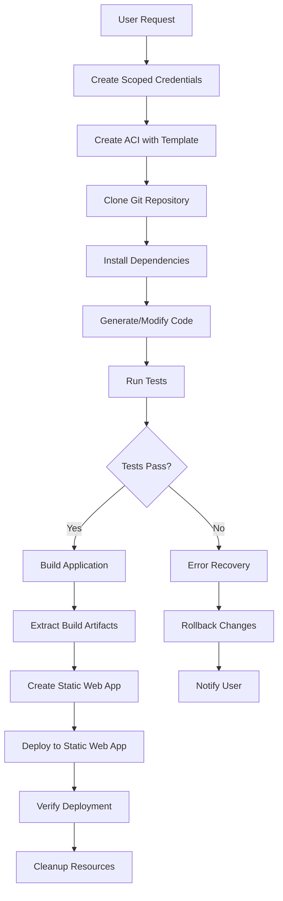

# Workflow Gaps Analysis: User Request to Azure Static Web App Deployment

## Current State Analysis

### ✅ What We Have
1. **Secure Operations API** - Validated operations for Git and Azure
2. **Credential Store** - Scoped, temporary credentials per user/project/task
3. **Container Templates** - Pre-built images for rapid deployment
4. **Git Integration** - Auto-clone on container startup
5. **Basic Command Execution** - Can run commands in containers

### ❌ Critical Gaps Identified

#### 1. **WebSocket Command Execution Not Implemented**
- Current: Returns mock data instead of real command output
- Impact: Cannot get real-time command execution results
- Fix: Implement WebSocket client for Azure Container Instance exec API

#### 2. **No End-to-End Workflow Orchestrator**
- Current: Individual operations work but no coordinated flow
- Impact: Manual coordination required between steps
- Fix: Create WorkflowOrchestrator class to manage complete pipeline

#### 3. **Missing Azure Static Web App Integration**
- Current: No deployment capability to Static Web Apps
- Impact: Cannot complete the deployment cycle
- Fix: Add Static Web App deployment operations to API

#### 4. **No Build Artifact Management**
- Current: Code stays in container, no artifact extraction
- Impact: Cannot deploy built applications
- Fix: Implement artifact extraction and storage

#### 5. **Limited Progress Tracking**
- Current: No real-time status updates
- Impact: User doesn't know deployment progress
- Fix: Implement event-based progress tracking

#### 6. **No Error Recovery Mechanism**
- Current: Failures require manual intervention
- Impact: Poor user experience on failures
- Fix: Implement retry logic and rollback capabilities

## Proposed Complete Workflow



## Implementation Plan

### Phase 1: WebSocket Command Execution
```typescript
interface WebSocketExecClient {
  connect(webSocketUri: string, password: string): Promise<void>;
  execute(command: string): Promise<ExecResult>;
  streamOutput(onData: (data: string) => void): void;
  close(): void;
}
```

### Phase 2: Workflow Orchestrator
```typescript
interface DeploymentWorkflow {
  id: string;
  userId: string;
  projectId: string;
  status: 'pending' | 'running' | 'completed' | 'failed';
  steps: WorkflowStep[];
  currentStep: number;
  startTime: Date;
  endTime?: Date;
  artifacts?: DeploymentArtifacts;
  deploymentUrl?: string;
  error?: string;
}

interface WorkflowStep {
  name: string;
  status: 'pending' | 'running' | 'completed' | 'failed' | 'skipped';
  startTime?: Date;
  endTime?: Date;
  output?: string;
  error?: string;
}
```

### Phase 3: Static Web App Integration
```typescript
interface StaticWebAppOperations {
  createStaticWebApp(params: CreateStaticWebAppParams): Promise<StaticWebApp>;
  deployToStaticWebApp(params: DeployParams): Promise<DeploymentResult>;
  getDeploymentStatus(deploymentId: string): Promise<DeploymentStatus>;
  rollbackDeployment(deploymentId: string): Promise<void>;
}
```

### Phase 4: Complete Pipeline Implementation

## Missing Components to Build

### 1. WebSocket Exec Client
- Connect to Azure Container Instance exec WebSocket
- Handle authentication with provided password
- Stream command output in real-time
- Handle binary data and terminal control sequences

### 2. Artifact Extractor
- Copy build output from container
- Compress artifacts for transfer
- Store in temporary blob storage
- Clean up after deployment

### 3. Static Web App Manager
- Create Static Web App resource
- Configure custom domains
- Set up GitHub Actions workflow
- Deploy from blob storage

### 4. Progress Tracker
- WebSocket server for real-time updates
- Event emitter for workflow steps
- Persistent status storage
- Client SDK for status queries

### 5. Error Recovery Agent
- Detect common failure patterns
- Implement retry strategies
- Rollback on critical failures
- Notify user with actionable steps

## Security Considerations

1. **Credential Isolation** - Each deployment gets unique credentials
2. **Container Isolation** - Each user/project in separate container
3. **Network Isolation** - Containers in isolated network
4. **Artifact Encryption** - Encrypt artifacts in transit and at rest
5. **Deployment Tokens** - Short-lived tokens for Static Web App deployment

## Performance Optimizations

1. **Parallel Operations** - Run independent steps in parallel
2. **Caching** - Cache dependencies and build artifacts
3. **Template Reuse** - Use pre-built container templates
4. **Resource Scaling** - Auto-scale containers based on workload
5. **CDN Integration** - Deploy static assets to CDN

## User Experience Improvements

1. **Real-time Progress** - WebSocket updates for each step
2. **Estimated Time** - Show ETA based on historical data
3. **Preview URLs** - Provide preview before production deployment
4. **Rollback UI** - One-click rollback to previous version
5. **Deployment History** - Track all deployments with diffs

## Testing Requirements

1. **End-to-End Tests** - Full workflow from request to deployment
2. **Failure Scenarios** - Test each failure point
3. **Recovery Tests** - Verify rollback mechanisms
4. **Performance Tests** - Ensure acceptable deployment times
5. **Security Tests** - Verify credential isolation

## Next Steps

1. Implement WebSocket exec client for real command execution
2. Create workflow orchestrator with state management
3. Add Static Web App deployment operations
4. Build progress tracking system
5. Implement error recovery mechanisms
6. Create comprehensive test suite
7. Document complete workflow for users